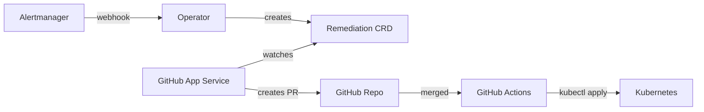

# heal8s

**Self-healing Kubernetes via GitHub Pull Requests**

[](https://opensource.org/licenses/Apache-2.0)
[](https://goreportcard.com/report/github.com/heal8s/heal8s)

heal8s is an open-source Kubernetes self-healing system that works through GitHub Pull Requests. It receives alerts from Prometheus/Alertmanager, creates remediation plans, and automatically generates PRs with fixes for human review and approval.

## Features

- **Alert-Driven Remediation**: Receives alerts from Alertmanager and automatically creates remediation plans
- **GitOps Workflow**: All changes go through GitHub PRs with full audit trail
- **Human Approval**: Critical changes require review before being applied
- **Multiple Remediation Scenarios**:
  - **OOMKill**: Automatically increase memory limits with smart calculation
  - **ScaleUp**: Increase replica count when HPA maxes out
  - **RollbackImage**: Revert to previous stable image on crash loops
- **CRD-Based**: Uses Kubernetes Custom Resource Definitions for state management
- **Direct Mode**: Optional immediate application for non-critical fixes
- **Prometheus Metrics**: Full observability with detailed metrics
- **Helm Chart**: Production-ready deployment with Helm
- **GitHub Actions**: Automated PR application workflow
- **Extensible**: Easy to add new remediation scenarios

## Architecture



**Components:**

1. **Operator** (in-cluster): Receives Alertmanager webhooks, creates Remediation CRDs
2. **GitHub App Service** (out-of-cluster): Watches Remediation CRDs, creates GitHub PRs
3. **Remediation CRD**: Kubernetes custom resource representing a remediation request

## Quick Start

### Prerequisites

- Go 1.22+ (operator requires Go 1.23; see `operator/go.mod`)
- kubectl, Helm 3
- Kind (for local development)
- Docker

### Fully isolated (recommended if you want nothing on the host)

Only **Docker** is required. Go, Helm and Kind are not needed on the machine — everything runs inside containers.

**1. Clone and go to the repo:**

```bash
git clone https://github.com/heal8s/heal8s.git
cd heal8s
```

**2. Configure Docker connection (optional but recommended):**

```bash
cp .env.example .env
```

Edit `.env` and set:

| Variable | When to set | Example |
|----------|-------------|---------|
| `DOCKER_HOST` | Remote Docker or non-default socket | Local (default): `unix:///var/run/docker.sock`. Remote: `tcp://your-host:2375` |
| `DOCKER_REGISTRY` | Private registry (pull base images or push) | `ghcr.io` or `docker.io` |
| `DOCKER_REGISTRY_USER` | Same as above | Your username or token name |
| `DOCKER_REGISTRY_TOKEN` | Same as above | Your token or password (keep secret; `.env` is gitignored) |

For a standard local Docker you can leave `.env` as in `.env.example` (or skip creating `.env`).

**3. Run the full pipeline in Docker:**

```bash
make all-in-docker
```

This builds the CI image, then inside it: unit tests, lint, operator image build, Kind cluster, Helm deploy, test app, Remediation, and assertions. First run can take a few minutes (downloading base image and building).

Individual steps: `make test-unit-in-docker`, `make lint-in-docker`, `make verify-in-docker`.

### One-command verification (local tools)

From the repo root, with Go, Helm and Kind installed locally:

```bash
make verify
```

This builds the operator image, starts Kind, deploys the operator via Helm (including CRDs), deploys a memory-leak test app, creates a Remediation CR, waits ~90s, and asserts that the remediation succeeded and memory limits were increased. To leave the cluster up after the run: `LEAVE_CLUSTER=1 make verify`.

### Local Development Setup

1. **Clone the repository:**

```bash
git clone https://github.com/heal8s/heal8s.git
cd heal8s
```

2. **Start local Kind cluster and deploy operator with Helm:**

```bash
make kind-up
make docker-operator
make kind-load-operator
make deploy-operator-helm
```

Or use **CRDs + run operator locally** (no Helm):

```bash
make kind-up
make install-operator   # install CRDs only
make run-operator       # run operator locally (needs cluster)
```

3. **Optionally run GitHub App service** (for GitOps PR flow):

```bash
cd github-app
go run ./cmd/server --kubeconfig ~/.kube/config
```

### Testing with an OOM scenario

Deploy a test app and create a Remediation (Direct mode applies in-cluster):

```bash
kubectl apply -f examples/test-app/memory-leak-deployment.yaml
# Create Remediation (e.g. in test-app or heal8s-system)
kubectl apply -f - <<'EOF'
apiVersion: k8shealer.k8s-healer.io/v1alpha1
kind: Remediation
metadata:
  name: oom-remediation
  namespace: test-app
spec:
  alert:
    name: KubePodOOMKilled
    fingerprint: test-1
    severity: critical
    source: manual
  target:
    kind: Deployment
    name: memory-leak-app
    namespace: test-app
    container: app
  action:
    type: IncreaseMemory
    params:
      memoryIncreasePercent: "50"
      maxMemory: "512Mi"
  strategy:
    mode: Direct
    requireApproval: false
    ttl: 1h
EOF
```

Watch remediations and deployment:

```bash
kubectl get remediations -A -w
kubectl get deployment memory-leak-app -n test-app -o jsonpath='{.spec.template.spec.containers[0].resources.limits.memory}'
```

## Configuration

### Operator Configuration

The operator can be configured via [`operator/config/manager/config.yaml`](operator/config/manager/config.yaml):

```yaml
alertRouting:
  KubePodOOMKilled:
    action: IncreaseMemory
    params:
      memoryIncreasePercent: 25
      maxMemory: "2Gi"
```

### GitHub App Configuration

Configure the GitHub App service via [`github-app/config/config.yaml`](github-app/config/config.yaml):

```yaml
github:
  appID: 123456
  installationID: 789012
  privateKeyPath: /secrets/github-app.pem

kubernetes:
  kubeconfig: ~/.kube/config
```

## Documentation

- [Architecture](docs/architecture.md) — System design and component interaction
- [Quick Start](docs/quick-start.md) — Local Kind setup and manual Remediation test
- [Helm Chart](charts/heal8s/README.md) — Install, configuration, and troubleshooting
- [AGENTS.md](AGENTS.md) — Guidelines for AI agents and build/test commands

## Development

### Project Structure

```
heal8s/
├── operator/              # Kubernetes operator (in-cluster)
│   ├── api/v1alpha1/     # CRD definitions
│   ├── internal/         # Internal packages
│   └── config/           # Kubernetes manifests
├── github-app/           # GitHub App service (out-of-cluster)
│   ├── cmd/server/       # Main entrypoint
│   └── internal/         # Internal packages
├── charts/               # Helm charts
├── examples/             # Example configurations
└── docs/                 # Documentation
```

### Building

Build all components:

```bash
make build-all
```

Operator Docker image (for Kind/verify):

```bash
make docker-operator   # IMG=heal8s/operator:dev
```

### Running Tests

Unit tests (no cluster):

```bash
make test-unit   # or make test — runs operator + github-app tests
```

Lint (fmt, vet, helm lint):

```bash
make lint
```

Full verify (Kind + Helm + Remediation + assert):

```bash
make verify
```

E2E only (cluster already up or use in-cluster operator):

```bash
make e2e
# Or: USE_IN_CLUSTER_OPERATOR=1 ./examples/e2e-test.sh
```

## Production Deployment

### Using Helm

```bash
# Add heal8s Helm repo (when published)
helm repo add heal8s https://heal8s.github.io/heal8s

# Install with default values
helm install heal8s heal8s/heal8s \
  --create-namespace \
  --namespace heal8s-system

# Or install from local chart
helm install heal8s charts/heal8s/ \
  --create-namespace \
  --namespace heal8s-system \
  --values custom-values.yaml
```

See [Helm Chart README](charts/heal8s/README.md) for detailed configuration options.

### Monitoring with Prometheus

heal8s exports comprehensive metrics:

```yaml
# ServiceMonitor for Prometheus Operator
kubectl apply -f examples/prometheus/servicemonitor.yaml

# Alert rules for heal8s
kubectl apply -f examples/prometheus/prometheusrules.yaml

# Alert rules for Kubernetes resources
kubectl apply -f examples/prometheus/kubernetes-alerts.yaml
```

Key metrics:
- `heal8s_alerts_received_total` - Alerts from Alertmanager
- `heal8s_remediations_created_total` - Remediations created
- `heal8s_remediations_succeeded_total` - Successful remediations
- `heal8s_remediations_failed_total` - Failed remediations
- `heal8s_remediation_duration_seconds` - Processing time

### GitHub Actions Auto-Apply

Set up automatic PR application:

1. **Copy workflow to your manifest repo**:
   ```bash
   mkdir -p .github/workflows
   cp examples/github-workflows/apply-remediation.yaml .github/workflows/
   ```

2. **Configure kubeconfig secrets** in GitHub:
   - `KUBECONFIG_DEV` - Development cluster
   - `KUBECONFIG_STAGING` - Staging cluster
   - `KUBECONFIG_PROD` - Production cluster

3. **Label your PRs**:
   - `heal8s` - Required label
   - `dev`/`staging`/`prod` - Target environment

See [GitHub Actions README](examples/github-workflows/README.md) for detailed setup.

## Contributing

We welcome contributions! Please see [CONTRIBUTING.md](CONTRIBUTING.md) for guidelines.

## License

This project is licensed under the Apache License 2.0 - see the [LICENSE](LICENSE) file for details.

## Roadmap

- [x] MVP: Operator + GitHub App + OOMKill scenario
- [x] Additional remediation scenarios (ScaleUp, RollbackImage)
- [x] GitHub Actions auto-apply workflow
- [x] Prometheus metrics and alerts
- [x] Helm chart for production deployment
- [x] Unit and E2E tests
- [ ] PostgreSQL audit trail
- [ ] Slack/Discord notifications
- [ ] Multi-cluster support
- [ ] Web dashboard
- [ ] AI-powered remediation suggestions

## Support

- GitHub Issues: [https://github.com/heal8s/heal8s/issues](https://github.com/heal8s/heal8s/issues)
- Discussions: [https://github.com/heal8s/heal8s/discussions](https://github.com/heal8s/heal8s/discussions)

## Acknowledgments

Built with:
- [Kubebuilder](https://github.com/kubernetes-sigs/kubebuilder)
- [controller-runtime](https://github.com/kubernetes-sigs/controller-runtime)
- [go-github](https://github.com/google/go-github)
