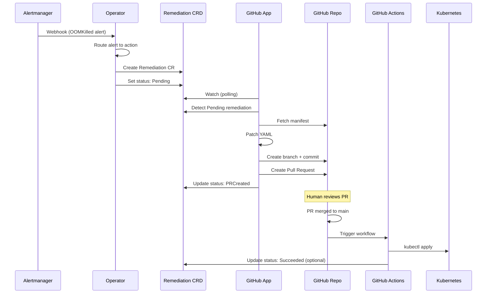

# heal8s Architecture

This document describes the architecture and design of heal8s, a self-healing Kubernetes system that works through GitHub Pull Requests.

## Overview

heal8s consists of three main components:

1. **Operator (in-cluster)**: Receives alerts from Alertmanager and creates Remediation CRs
2. **GitHub App Service (out-of-cluster)**: Watches Remediation CRs and creates GitHub PRs
3. **GitHub Actions**: Applies approved changes to the cluster

## Architecture Diagram



## Component Details

### 1. Operator (In-Cluster)

**Location**: `operator/`

**Responsibilities**:
- Receive Alertmanager webhooks on port 8082
- Parse alerts and route to remediation actions
- Create Remediation Custom Resources
- Reconcile Remediation CRs (manage lifecycle)
- Optionally apply Direct mode remediations

**Key Files**:
- `api/v1alpha1/remediation_types.go` - CRD definition
- `internal/controller/remediation_controller.go` - Reconciler
- `internal/webhooks/alertmanager_handler.go` - Webhook endpoint
- `internal/remediate/router.go` - Alert routing logic
- `internal/remediate/oom.go` - OOMKill remediation logic

**RBAC Requirements**:
```yaml
- apps: deployments, statefulsets, daemonsets (get, list, watch, patch)
- core: pods (get, list, watch)
- k8shealer.k8s-healer.io: remediations (all)
```

### 2. GitHub App Service (Out-of-Cluster)

**Location**: `github-app/`

**Responsibilities**:
- Connect to Kubernetes cluster (out-of-cluster)
- Watch Remediation CRs with `spec.github.enabled=true` and `status.phase=Pending`
- Fetch manifest files from GitHub repository
- Patch YAML based on remediation action
- Create GitHub branches, commits, and Pull Requests
- Update Remediation CR status

**Key Files**:
- `cmd/server/main.go` - Main entrypoint
- `internal/k8s/client.go` - Kubernetes client
- `internal/github/client.go` - GitHub API client
- `internal/yaml/patcher.go` - YAML patching logic
- `internal/remediation/processor.go` - Main processing loop

**Configuration**:
```yaml
github:
  appID: <GitHub App ID>
  installationID: <Installation ID>
  privateKeyPath: /path/to/private-key.pem

kubernetes:
  kubeconfig: ~/.kube/config
  namespace: heal8s-system

processor:
  pollInterval: 10s
  batchSize: 10
```

### 3. Remediation CRD

**API Group**: `k8shealer.k8s-healer.io/v1alpha1`

**Spec Fields**:
- `alert`: Alert information (name, fingerprint, severity, payload)
- `target`: Target Kubernetes resource (kind, name, namespace, container)
- `action`: Remediation action (type, parameters)
- `strategy`: How to apply (GitOps vs Direct, requireApproval, TTL)
- `github`: GitHub integration config (owner, repo, branch, manifest path, PR settings)

**Status Fields**:
- `phase`: Current phase (Pending → Analyzing → PRCreated → Applying → Succeeded/Failed/Expired)
- `prNumber`, `prURL`: GitHub PR details
- `commitSHA`: Git commit SHA
- `appliedAt`, `resolvedAt`: Timestamps
- `conditions`: Kubernetes-style conditions

**Example**:
```yaml
apiVersion: k8shealer.k8s-healer.io/v1alpha1
kind: Remediation
metadata:
  name: rem-oom-api-20250210-120001
  namespace: prod
spec:
  alert:
    name: KubePodOOMKilled
    fingerprint: abc123
    severity: critical
    source: alertmanager
  target:
    kind: Deployment
    name: api-service
    namespace: prod
    container: api
  action:
    type: IncreaseMemory
    params:
      memoryIncreasePercent: "25"
      maxMemory: "2Gi"
  strategy:
    mode: GitOps
    requireApproval: true
    environment: prod
    ttl: 24h
  github:
    enabled: true
    owner: myorg
    repo: k8s-manifests
    baseBranch: main
    manifestPath: "k8s/{environment}/{namespace}/{name}.yaml"
status:
  phase: PRCreated
  prNumber: 123
  prURL: https://github.com/myorg/k8s-manifests/pull/123
```

## Data Flow

### Alert Reception Flow

1. **Alert Fired**: Prometheus detects issue (e.g., OOMKill)
2. **Alertmanager Webhook**: Sends POST request to operator webhook endpoint
3. **Alert Parsing**: Operator extracts labels (namespace, pod, container, alertname)
4. **Alert Routing**: Router maps alertname to action type (OOMKilled → IncreaseMemory)
5. **Deduplication**: Check if remediation already exists for this fingerprint
6. **CR Creation**: Create Remediation CR with status: Pending

### GitOps Remediation Flow

1. **Watch**: GitHub App polls for Pending remediations
2. **Fetch Manifest**: Download current manifest from GitHub
3. **Patch**: Apply strategic merge patch (e.g., increase memory)
4. **Create Branch**: `heal8s/increase-memory/api-service-20250210-120001`
5. **Commit**: Commit patched manifest
6. **Create PR**: Create PR with detailed description
7. **Update Status**: Set phase=PRCreated with PR details
8. **Human Review**: DevOps engineer reviews PR
9. **Merge**: PR merged to main
10. **GitHub Actions**: Workflow triggers `kubectl apply`
11. **Applied**: Remediation deployed to cluster

### Direct Remediation Flow (Optional)

Used when `strategy.mode=Direct` and `requireApproval=false`:

1. Alert → Remediation CR created
2. Controller immediately patches Kubernetes resource
3. Status updated to Succeeded
4. No PR created (emergency mode)

## Security Model

### Operator Security

- Runs in-cluster with ServiceAccount
- Minimal RBAC: only `patch` permissions on workloads
- No secret reading capabilities
- Webhook endpoint unauthenticated (internal only)

### GitHub App Security

- Runs out-of-cluster
- Authenticates via GitHub App private key
- Installation tokens (auto-refresh every hour)
- Read-only access to Kubernetes (watches CRs, updates status)
- No direct cluster modification capabilities

### GitHub Repository Security

- All changes via Pull Requests
- Branch protection rules recommended
- Required reviews for production environments
- Audit trail via Git history

## Scalability

### Operator

- Stateless (can run multiple replicas with leader election)
- Controller-runtime efficient reconciliation
- Deduplication prevents duplicate remediations

### GitHub App

- Stateless (can run multiple instances)
- Polling-based (no webhook dependencies)
- Configurable poll interval and batch size

### Limitations

- Poll interval creates delay (default 10s)
- GitHub API rate limits (5000 req/hour for Apps)
- One Remediation = One PR (no batching)

## Failure Modes

### Operator Failures

- **Crash**: Kubernetes restarts, alerts queued in Alertmanager
- **Webhook Unreachable**: Alertmanager retries with exponential backoff
- **Invalid Alert**: Skipped, logged

### GitHub App Failures

- **GitHub API Down**: Retries on next poll cycle
- **Manifest Not Found**: Status set to Failed
- **PR Creation Failed**: Status set to Failed, can be retried

### GitHub Actions Failures

- **kubectl Apply Failed**: Manual intervention required
- **Merge Conflict**: Manual resolution required

## Observability

### Metrics

**Operator**:
- `heal8s_alerts_received_total`
- `heal8s_remediations_created_total`
- `heal8s_remediations_succeeded_total`
- `heal8s_remediations_failed_total`

**GitHub App**:
- `heal8s_prs_created_total`
- `heal8s_processing_duration_seconds`

### Logs

- Structured logging (JSON format)
- Log levels: Debug, Info, Error
- Key fields: remediation name, alert fingerprint, PR number

### Events

Kubernetes Events created for important state changes:
- Remediation created
- PR created
- Applied successfully
- Failed with reason

## Future Enhancements

1. **Webhook Mode**: GitHub App receives webhooks instead of polling
2. **Multi-Cluster**: Support remediating across multiple clusters
3. **AI Recommendations**: ML-based remediation suggestions
4. **Batch PRs**: Group multiple remediations into one PR
5. **Rollback**: Automatic rollback if remediation makes things worse
6. **Slack Integration**: Notify team in Slack with approve/reject buttons
7. **Policy Engine**: OPA-based approval policies
8. **Metrics Analysis**: Use Prometheus metrics to validate remediation success
