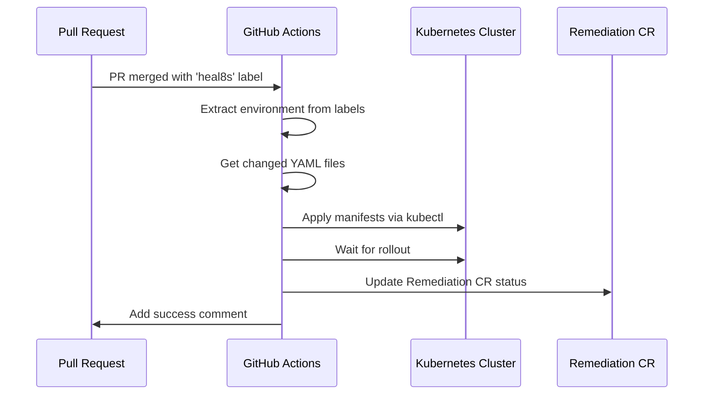

# GitHub Actions Workflow for heal8s

This directory contains GitHub Actions workflows for automating heal8s remediation application.

## Workflow: Apply Remediation

The `apply-remediation.yaml` workflow automatically applies Kubernetes manifests to your cluster when a heal8s Pull Request is merged.

### How It Works



### Setup

#### 1. Create Environment Secrets

For each environment (dev, staging, prod), create a secret with the kubeconfig:

```bash
# Encode your kubeconfig
cat ~/.kube/config | base64 -w 0

# Add as GitHub secret:
# Settings -> Secrets and variables -> Actions -> New repository secret
# Name: KUBECONFIG_DEV (or KUBECONFIG_STAGING, KUBECONFIG_PROD)
# Value: <base64-encoded kubeconfig>
```

#### 2. Label Your Pull Requests

The workflow is triggered by PRs with the `heal8s` label and an environment label:

- `heal8s` - Required for all heal8s PRs
- `dev` / `staging` / `prod` - Determines target environment

Example:
```bash
gh pr edit 123 --add-label heal8s,staging
```

#### 3. Workflow Triggers

The workflow runs when:
- A PR with the `heal8s` label is merged
- The PR targets `main` or `master` branch

### Environment Configuration

The workflow supports multiple environments:

| Environment | Secret Name | When Used |
|-------------|------------|-----------|
| dev | `KUBECONFIG_DEV` | PR has `dev` label |
| staging | `KUBECONFIG_STAGING` | PR has `staging` label |
| prod | `KUBECONFIG_PROD` | PR has `prod` label |

### Pull Request Format

heal8s automatically creates PRs with this format:

```markdown
## heal8s Remediation

**Type:** IncreaseMemory
**Target:** default/my-deployment
**Trigger:** KubePodOOMKilled

### Changes
- Increased memory limit from 256Mi to 384Mi
- Increased memory request from 128Mi to 192Mi

### Remediation Details
- Alert: KubePodOOMKilled (fingerprint: abc123)
- Severity: critical
- Remediation CR: default/oom-remediation-abc123

---
*This PR was automatically created by heal8s*
```

### Workflow Steps

1. **Extract Environment**: Determines target cluster from PR labels
2. **Setup kubectl**: Installs kubectl v1.29.0
3. **Configure Access**: Loads kubeconfig from secrets
4. **Extract Details**: Parses remediation info from PR body
5. **Get Changes**: Identifies modified YAML files
6. **Apply Manifests**: Applies changes via `kubectl apply`
7. **Verify**: Waits for deployment rollout
8. **Update CR**: Patches Remediation CR status to `Succeeded`
9. **Comment**: Adds success/failure comment to PR

### Manual Trigger

To manually apply a remediation:

```bash
# Merge the PR
gh pr merge 123 --merge

# Or use the GitHub UI to merge
```

### Customization

#### Change Target Branch

Edit the workflow to target different branches:

```yaml
on:
  pull_request:
    types: [closed]
    branches:
      - main
      - develop  # Add additional branches
```

#### Add Pre-Apply Checks

Add validation before applying:

```yaml
- name: Validate manifests
  run: |
    CHANGED_FILES='${{ steps.changed-files.outputs.files }}'
    echo "$CHANGED_FILES" | while read -r file; do
      if [ -n "$file" ]; then
        kubectl apply --dry-run=client -f "$file"
      fi
    done
```

#### Add Notifications

Send notifications to Slack or other services:

```yaml
- name: Notify Slack
  if: success()
  uses: slackapi/slack-github-action@v1
  with:
    payload: |
      {
        "text": "✅ Remediation applied: ${{ github.event.pull_request.title }}"
      }
  env:
    SLACK_WEBHOOK_URL: ${{ secrets.SLACK_WEBHOOK }}
```

### Troubleshooting

#### Workflow Not Triggering

**Problem**: Workflow doesn't run when PR is merged

**Solutions**:
- Verify PR has `heal8s` label
- Check PR targets `main` or `master` branch
- Ensure workflow file is in `.github/workflows/` directory
- Check GitHub Actions are enabled for the repo

#### kubectl Apply Fails

**Problem**: `kubectl apply` command fails

**Solutions**:
- Verify kubeconfig secret is correctly base64-encoded
- Check cluster is accessible from GitHub Actions runners
- Ensure service account has proper RBAC permissions
- Test kubeconfig locally first

#### Remediation CR Not Found

**Problem**: Workflow can't find Remediation CR to update

**Solutions**:
- Verify heal8s operator is running in target cluster
- Check Remediation CRD is installed
- Ensure PR number matches CR `.status.prNumber` field
- Check namespace matches

### Security Best Practices

1. **Use Least Privilege**: Grant minimal RBAC permissions
   ```yaml
   apiVersion: v1
   kind: ServiceAccount
   metadata:
     name: github-actions
     namespace: default
   ---
   apiVersion: rbac.authorization.k8s.io/v1
   kind: Role
   metadata:
     name: github-actions-deployer
   rules:
   - apiGroups: ["apps"]
     resources: ["deployments"]
     verbs: ["get", "patch"]
   - apiGroups: ["k8shealer.k8s-healer.io"]
     resources: ["remediations/status"]
     verbs: ["patch"]
   ```

2. **Use Environment Protection Rules**:
   - Require approvals for prod deployments
   - Add required reviewers
   - Settings -> Environments -> prod -> Required reviewers

3. **Audit Trail**:
   - All changes tracked in git history
   - PR reviews provide approval records
   - Workflow runs logged in GitHub Actions

4. **Secrets Rotation**:
   - Rotate kubeconfig secrets regularly
   - Use time-limited tokens when possible
   - Monitor for unauthorized access

### Examples

#### Production Deployment with Approval

```yaml
jobs:
  apply-remediation:
    runs-on: ubuntu-latest
    environment: production  # Requires approval
    steps:
      # ... workflow steps ...
```

#### Multi-Cluster Deployment

```yaml
strategy:
  matrix:
    environment: [us-east-1, us-west-2, eu-west-1]
steps:
  - name: Configure kubectl
    env:
      KUBECONFIG_CONTENT: ${{ secrets[format('KUBECONFIG_{0}', matrix.environment)] }}
```

## Additional Resources

- [GitHub Actions Documentation](https://docs.github.com/en/actions)
- [kubectl Reference](https://kubernetes.io/docs/reference/kubectl/)
- [heal8s Architecture](../../docs/architecture.md)
